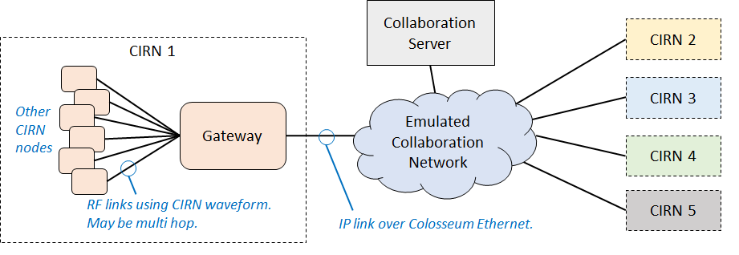
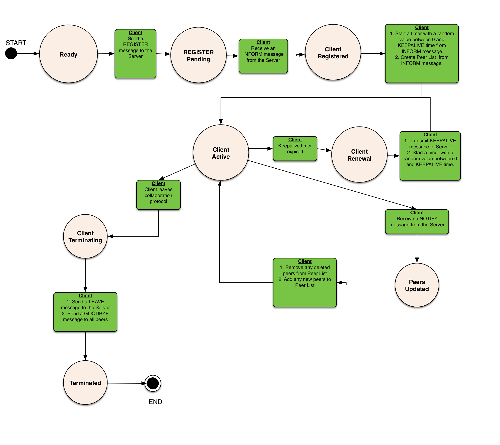
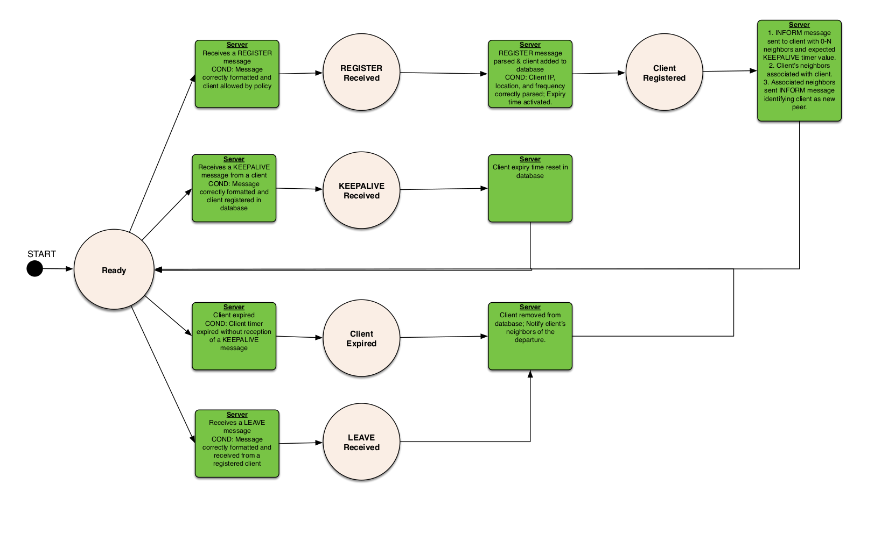
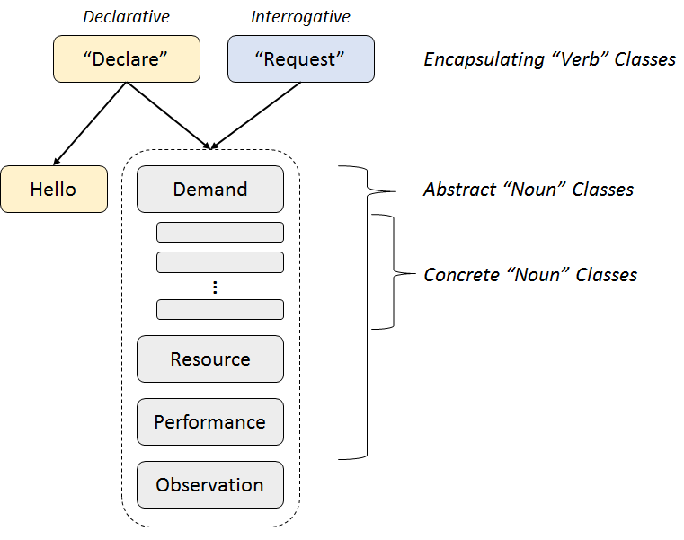
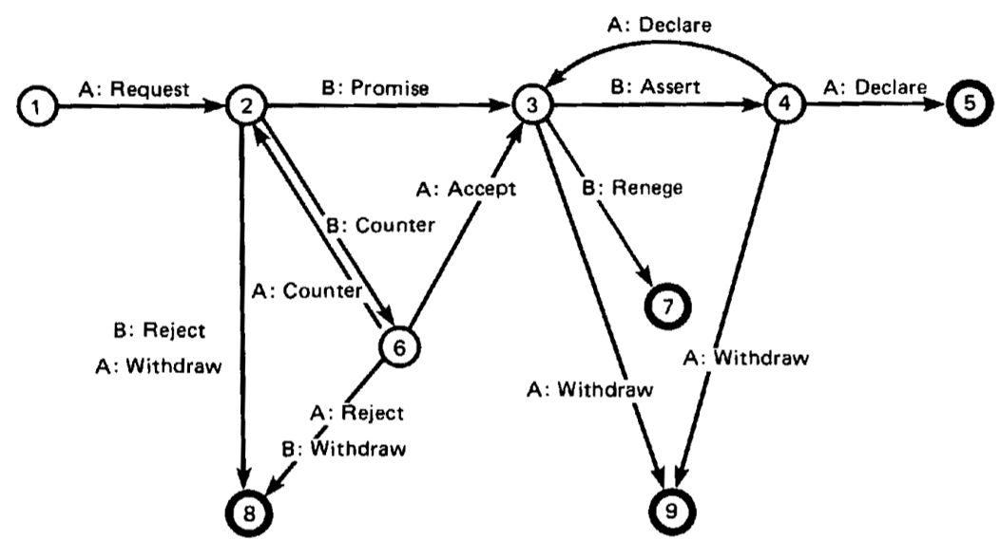

https://spectrumcollaborationchallenge.com

# Collaboration Protocol Specification

## Table of Contents 
1. [**Introduction**](#introduction)
2. [**Collaboration Protocol Server Specification**](#collaboration-protocol-server-specification)
    * [Collaboration Protocol Transport Layer](#collaboration-protocol-transport-layer)
    * [Connecting to the Collaboration Protocol Server](#connecting-to-the-collaboration-protocol-server)
    * [Collaboration Protocol Message Definitions](#collaboration-protocol-message-definitions)
    * [Client Interactions](#client-interactions)
3. [**Collaboration Protocol Peer-to-Peer Specification**](#collaboration-protocol-peer-to-peer-specification)
    * [Introduction and Design](#introduction-and-design)
    * [Required Peer to Peer Messages](#required-peer-to-peer-messages)
    * [Informational Sub Protocol Design](#informational-sub-protocol-design)
4. [**Protocol File Organization**](#protocol-file-organization)
    * [Conversational Sub Protocol](#conversational-sub-protocol)


## Introduction
This specification is identical to that used in Phase 1 of the Spectrum Collaboration Challenge. As such, it includes a large amount of functionality not required for the Phase 3 Hurdle. 

To arrive at this version of the Collaboration Protocol, competitors were given an initial framework and allowed to submit updates to it. A Collaboration Protocol Working Group reviewed those submissions and incorporated those deemed complete and general enough to be widely useful. 

The Practice and Hurdle bots will not use all features of the protocol. The SC2 Team does not expect that solutions to the Phase 3 Hurdle will need to support all features in the Collaboration Protocol to be successful. 

The Collaboration Protocol (CP) has 2 basic parts:

1. *Client / Server exchange* – a protocol and set of semantics for interacting with the Collaboration Server to retrieve the address of other Collaborative Intelligent Radio Networks (CIRNs) in your local neighborhood.
2. *Peer-to-Peer exchange* – a protocol and set of semantics for describing the interaction of two CIRN gateway nodes (considered peers).  This is the primary focus of the overall protocol.
 

The client/server portion is purposefully kept as simple as possible and exists only to serve as a simple service to allow networks to find peer networks (e.g., other network CIRN gateway nodes). In the real world this protocol would need to be more complex and cover many corner cases not relevant to the SC2 Challenge.  As such you'll find its greatly simplified in this setting (e.g. SC2) from the semantics of a typical client/server exchange.
 
The peer-to-peer portion of the protocol is the primary element which enables CIRNs to exchange information with each other directly, and allow true collaboration. Very few of the exchanges supported by the protocol will be required so that competitors can focus their time on those exchanges they believe to be most useful. The most widely adopted messages will then naturally "rise to the top" in terms of usefulness, others will naturally self-deprecate.  More detailed information on the general structure of the protocol is given below in the Collaboration Protocol Peer-to-Peer specification section below.

### Interface Files
The Collaboration Protocol interface file describes all peer-to-peer messages. See below for a link to the file:
[collaboration.proto](../collab_protocol/collaboration.proto)

The Registration interface file describes all server <-> client messages. See below for a link to the file:
[registration.proto](../collab_protocol/registration.proto)

 
## Example Collaboration Server and Client Code

There are simple example implementations of the Collaboration Server and a Python client in [collab_protocol/python/collab_client.py](../collab_protocol/python/collab_client.py) and [collab_protocol/python/collab_server.py](../collab_protocol/python/collab_server.py). Please note that the example client is not intended to support high messaging rates, only to illustrate how to register with the server, form and send messages, and receive and parse messages. 


This page captures the high level design of the Collaboration Protocol and the 3 major associated parts of the protocol.  The code itself which documents the various messages described here is captured in the Interface .proto files specified earlier.

 
## Collaboration Protocol Server Specification

The Collaboration Protocol Server allows the gateways of peer networks to discover each other. The server also keeps track of active clients and will periodically update all connected clients with a list of gateways that have newly joined or have left. This section documents how gateway nodes are expected to interact with the Collaboration Server.  As shown in the below illustration all gateway nodes access the Collaboration Server via a network which is capable of emulating a variety of types of potential networks.




### Summary
| **Parameter**                    | **Specification** |
| ----------------------------     | ------------- |
| Collaboration Server Address     | varies by session, see colosseum_config.ini |
| Collaboration Server Listen Port | defaults to 5556, specified in colosseum_config.ini  | 
| Collaboration Client Listen Port | defaults to 5557, specified in colosseum_config.ini  |
| Transport Layer 	           | TCP |
| Message Framing  	           | ZeroMQ PUSH and PULL Sockets |
| Message Format  	           | Protocol Buffer messages defined in registration.proto | 


## Collaboration Protocol Transport Layer

The collaboration protocol uses ZeroMQ ( http://zeromq.org/ ) running over TCP for all message passing, both server/client and peer-to-peer. ZeroMQ runs on most operating systems with APIs in most languages, providing simple asynchronous message passing. The expectation is that there will be a Collaboration server per session, where that session may be a batch mode session, a scrimmage, or the final competition. 


## Connecting to the Collaboration Protocol Server

Competitors will be given the host name that the Collaboration Protocol Server is using via the collab_server_ip parameter in the COLLABORATION section of colosseum_config.ini.  See below for an example excerpt from colosseum_config.ini

```ini
[RF]
rf_bandwidth = 1000000.0
center_frequency = 1000000000.0

[COLLABORATION]
collab_client_port = 5557
collab_peer_port = 5558
collab_server_port = 5556
collab_server_ip = 172.30.101.1

[ENVSIM]
envsim_port = 52004
envsim_ip = 192.168.40.2
```

## Collaboration Protocol Message Definitions

Each message used in the client/server interaction of the Collaboration Protocol is formatted as a short protocol buffer message. It is expected that competitors send these messages to the Collaboration Protocol Server using a ZeroMQ Push socket. The list of registration messages is outlined below. Please always check the GitHub repository for the most up-to-date version of registration.proto. If the section below is ever in conflict with the version of the file on GitHub, the version on GitHub has precedence. 

```protobuf 
// uses V3.0 of the Protocol Buffer Specification
syntax = "proto3";

//=================================================================================================
//
// SC2 Phase 1 Collaboration Protocol Registration Messages
//
//=================================================================================================


// ------------------------------------------------------------------------------------------------
// Client -> Server Messages
//

/// Top level wrapper message for all Client -> Server messages
message TalkToServer
{
    oneof payload
    {
        /// See Register documentation
        Register register = 1;

        /// See Keepalive documentation
        Keepalive keepalive = 2;

        /// See Leave documentation
        Leave leave = 3;
    }
}

/// The Register message includes the sender's IP address and is used to inform the server that
// a new gateway would like to join the Collaboration Channel
message Register
{
    uint32 my_ip_address = 1;
}

/// The Keepalive message is used to tell the server that a gateway is still active. It includes
// The client-specific Nonce provided by the server when the client gateway first registered
message Keepalive
{
    int32 my_nonce = 1;
}

/// The Leave message is used to tell the server that a gateway is leaving the Collaboration 
// Channel. It includes the client-specific Nonce provided by the server when the client gateway
// first registered
message Leave
{
    int32 my_nonce = 1;
}

// ------------------------------------------------------------------------------------------------
// Server -> Client Messages
//

/// Top level wrapper message for all Server -> Client messages
message TellClient
{
    oneof payload
    {
        /// See Inform documentation
        Inform inform = 1;

        /// See Notify documentation
        Notify notify = 2;
    }
}

/// Message sent in response to a Register message that tells the client their unique ID, the
// maximum keepalive count, and the list of known IP addresses in the Collaboration Channel
message Inform
{
    /// unique ID per client
    int32 client_nonce = 1;

    /// maximum time in seconds between keepalives before a client is considered dead
    float keepalive_seconds = 2;

    /// list of ip addresses in the collaboration channel
    repeated uint32 neighbors = 3;
}

/// Messages sent in response to a node joining or leaving the network
message Notify
{
    /// list of ip addresses in the collaboration channel
    repeated uint32 neighbors = 1;
}

```


The TalkToServer message wrapper is used to allow the Server to receive and parse Register, Keepalive, and Leave messages on the same ZeroMQ socket without knowing which message to expect ahead of time. The TellClient message is used by clients in much the same way, allowing them to receive and parse Inform and Notify messages on the same ZeroMQ socket. 


## Client Interactions

Once a node in a competitor's network determines that it is in fact a gateway node, it must register with the Collaboration Protocol Server. To do this, it sends a Register message to the server. In response to a valid Register message, the server will respond with an Inform message, which provides the client gateway node with a list of neighbor gateways, the maximum value for the keepalive timer, and a Nonce specific to that client. The server will also send a Notify message to all clients that have previously registered. This message tells each client that a new network has joined the Collaboration Protocol Session so they can initiate peer-to-peer connections to the new network, if so desired. 

Once registered, a client must periodically send the server Heartbeat messages at least as often as dictated by the keepalive timer value specified in the Inform message sent by the server. The server uses these messages to determine whether a network node has crashed. If a client fails to generate Heartbeat messages consistently, the server will assume it has died and send all remaining clients a Notify message to inform them that the dead client network is no longer active.

At the end of a scenario, clients may send the server a Leave message to notify the server they will no longer be participating in the Collaboration Protocol session. 

The state machine diagram below illustrates these interactions from the perspective of the client state machine.

## Client State Machine



The next diagram shows this same set of interactions from the perspective of the Server state machine. 

## Server State Machine



## Collaboration Protocol Peer-to-Peer Specification
 
### Introduction and Design

Many of the design elements are based on the very excellent 1987 Winograd Paper: [A language/action perspective on the design of cooperative work](https://scholar.google.com/scholar?hl=en&q=A+language%2Faction+perspective+on+the+design+of+cooperative+work&btnG=&as_sdt=1%2C47&as_sdtp=).


After discovering other peer CIRN gateways through interaction with the Collaboration Server, CIRNs may then conduct collaborative spectrum operations through direct peer-to-peer interaction.


### Summary
| **Parameter**                    | **Specification** |
| ---------------------------- | ------------- |
| Peer-to-Peer listening port  | defaults to 5558, specified in colosseum_config.ini |
| Transport Layer 	           | TCP |
| Message Framing  	           | ZeroMQ PUSH and PULL Sockets |
| Message Format  	           | Protocol Buffer messages defined in collaboration.proto |


The Collaboration Protocol Peer-to-Peer messaging has two primary aspects that divide the overall functionality.


* Informational Sub Protocol – This part of the protocol captures messages that provide or seek information without any formal or standing arrangement between networks.
* Conversational Sub Protocol – This part of the protocol captures messages that form the basis for the process of allowing multiple networks to enter into an arrangements or seek agreement.

 
### Required Peer to Peer Messages

By design, radio networks need only support a small subset of the Collaboration protocol to be considered compliant. The majority of messages and message fields are optional. The required messages and message fields are:

* collaborate.hello
* collaborate.hello.my_dialect
* collaborate.hello.my_network_id
* collaborate.informational_declaration.performance.scalar_performance 

Radio networks must support the full set of messages defined in the Client/Server exchange. 


### Informational Sub Protocol Design

The Informational Sub Protocol captures messages that provide or seek information without any formal or standing arrangement between networks.

The high level design of this portion of the protocol is based on a tiered Object hierarchy that is intended to capture the vast majority of circumstances in which heterogeneous radio networks might collaborate without a standing agreement or arrangement.


* Encapsulating "Verb" Classes – These objects encapsulate other objects and imply the natural language semantics associated with the verb.
    * "Declare" – Provide information for consumption of other CIRN gateways (i.e., make a statement)
    * "Request" –  Request information from another CIRN gateway (i.e., ask a question)
* Abstract "Noun" Classes – These are abstract classes which describe 4 general types of information expected to be shared between CIRNs.  In keeping with good Object Oriented design practices these classes won't be directly instantiated.
    * Demand – A description the demand (e.g. traffic load) a radio node, or network is experiencing
    * Resource – A description of the resources (e.g. time, frequency, space, power) consumed, possibly to meet a demand
    * Performance – A description of the performance achieved, potentially in relation to resources used, or demand presented
    * Observation – A description of  some observation made in the wireless environment
* Concrete "Noun" Classes – These are subclasses of the abstract classes which given specific semantics to a particular type of object. 



### Protocol File Organization

In a typical object oriented programming language, the Collaboration Protocol would be realized through traditional Object Oriented Polymorphism.  For example in C++ the objects in the protocol might be written as follows:


```c++
// Base Noun Class

class Noun{};

// Abstract Noun Classes, each inherits from Noun

class Demand : public Noun{};
class Resource : public Noun{};
class Performance : public Noun{};
class Observation : public Noun{};

// Example concrete class
class PSD : public Observation {
    // PSD fields go here
};

class Spectrogram : public Observation{
    // Specgram fields go here
};

class NodeLocations : public Observation{
    // Node Location fields go here
};

// The Encapsulating Verb Classes
class Declare{
    // The Noun that we are declaring (i.e. encapsulating)
    Noun noun;
};

class Request{
    // The Noun that we are requesting (i.e. encapsulating)
    Noun noun;
};
```
 

To achieve these goals, the SC2 team has leveraged certain features of the Protocol Buffer specification to emulate a basic form of polymorphism (as protocol buffers does not directly support traditional polymorphism as in the example above). The primary feature that enables this is the use of the "oneof" construct. A "oneof" declaration looks like the following:

 
```protobuf
/// An Observation is something that can be directly viewed by a node or network. This may be

// something like the current position information a node is seeing, or the power spectral density
// a node saw at a specific point over a particular time range. Observations are optionally tied
// to a location or a specific node in a network. 
message Observation // abstract top level class
{
    /// each subclass of Observation must be added to this enum as a convienient
    // way to reference supported objects in the Hello message between networks
    enum Type 
    {
        UNKNOWN = 0; /// new types will show up as UNKNOWN
        PSD = 100; /// PSD type ID
        SPECTROGRAM = 101; /// Spectrogram type ID
        NODE_LOCATIONS = 102; /// NodeLocations type ID
    }

    Location location = 1; /// optional field used to specify the location of the observation
    int32 node_id  = 2; /// optional field used to specify the node id of the observer

    /// only one of these fields can be filled out per individual Observation message
    oneof payload 
    {
        PSD psd = 100; /// See the PSD documentation
        Spectrogram spectrogram = 101; /// See the Spectrogram documentation
        Node_Locations node_locations = 102; /// See the Node_Locations documentation
    }
}
```

In the above declaration, you see a set of different data types, each defined with a name and a "tag" or field number. As the name suggests, only "one of" these data structures will ever exist in a message. This is very different from how optional fields are handled. The underlying Protocol Buffer code strictly enforces that only one of the fields ever exists at a time, whereas any number of optional fields may be included. The automatically generated Protocol Buffer code provides a function call to determine which of these fields is filled in. See here for detailed documentation on the "oneof" construct: https://developers.google.com/protocol-buffers/docs/proto3#oneof


To enable competitors to share information about what sort of messages they support, the .proto file includes a Dialect construct. This is implemented as a set of lists of integers. Each list is tied to a top level "verb" message. Each message type gets an ID, implemented as an enumeration of all the available messages within a top level message class. The lists in the Dialect construct allow competitor networks to tell other networks exactly which messages they support, so everyone will know the types of information each network can understand. This should minimize how much useless information is sent across the Collaboration Protocol Network. 

 
### Conversational Sub Protocol
The Conversational Sub Protocol is largely based on Winograd, ["A language/action perspective on the design of cooperative work."](https://scholar.google.com/scholar?hl=en&q=A+language%2Faction+perspective+on+the+design+of+cooperative+work&btnG=&as_sdt=1%2C47&as_sdtp=)




The version of this state machine currently proposed in the Conversational subprotocol uses a simplified nomenclature as compared to Winograd. 
 
#### Simplifying Nomenclature
**Accept** and **Promise** appear to be distinctions without differences. We'll only use **Agree**.
**Assert** is a commonly reserved term in programming languages. We'll replace **Assert** with **Claim**. **Declare** is used elsewhere in the Collaboration protocol. To reduce the potential for confusion, we'll replace **Declare** with **Confirm**.
**Withdraw**, **Reject**, and **Renege** all result in terminal states. Only keep **Withdraw**. 

Here are the remaining messages:
* Request
* Counter
* Agree
* Claim
* Confirm
* Withdraw
 
 
Let's start by walking through some paths of this conversation. The messages used in the Collaboration protocol will all be bolded.
 
#### Path 1: Simplest successful path imaginable
1. Network A sends Network B a **Request**. 
2. Network B is OK with that **Request**, and Promises/**Agrees** to abide by it. 
3. Network A and B both try to live up to obligations set up in the **Request**. 
4. When Network B feels that it has lived up to it's end, it Asserts/**Claims** that it is done.
5. Network A agrees with B and Declares/**Confirms** that B's Assert/**Claim** was successful. The conversation is over. 
 
#### Path 2: Negotiation
1. Network A sends Network B a **Request**. 
2. Network B isn't completely happy with the conditions of the **Request**, and instead replies with a **Counter**. 
3. Network A is OK with that **Counter**, and Accepts/**Agrees** to it. 
4. When Network B feels that it has lived up to it's end, it Asserts/**Claims** that it is done.
5. Network A disagrees with B and Declares/**Confirms** that B's Assert/**Claim** was unsuccessful. 
6. Network B tries a little harder and once it is really sure that it is done, it sends A another Assert/**Claim**. 
7. Network A agrees with B and Declares/**Confirms** that B's Assert/**Claim** was successful. The conversation is over. 
 
At any point, either A or B can **Withdraw** to unilaterally end the conversation.

