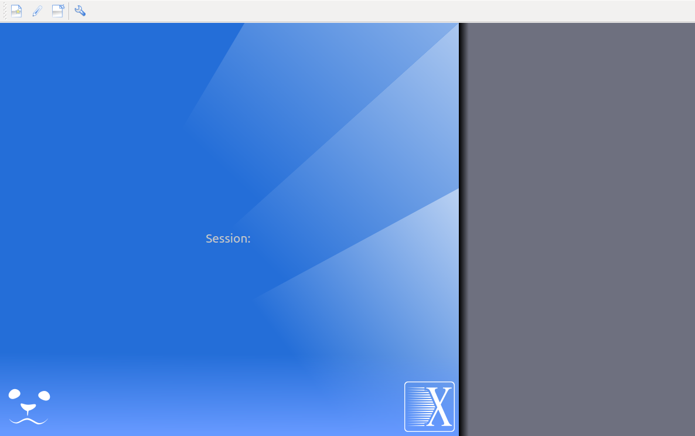
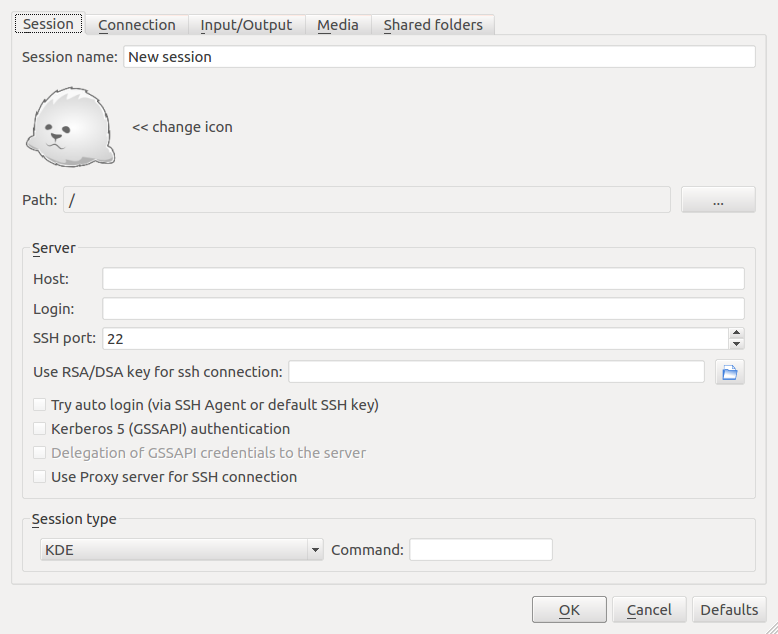
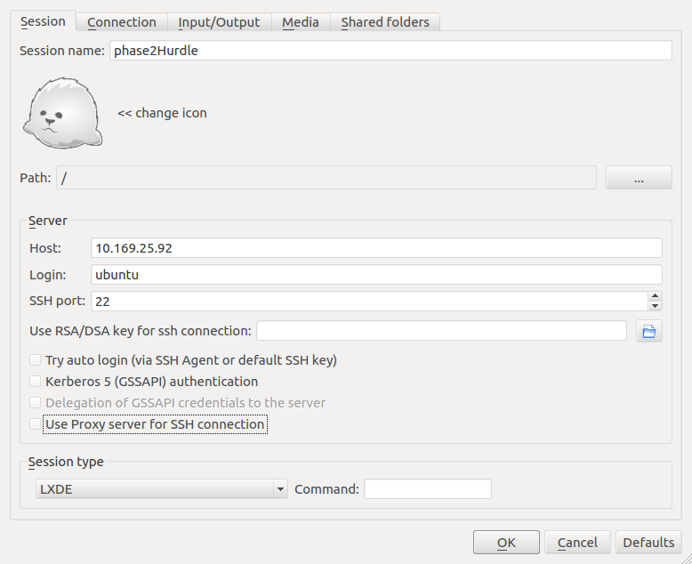
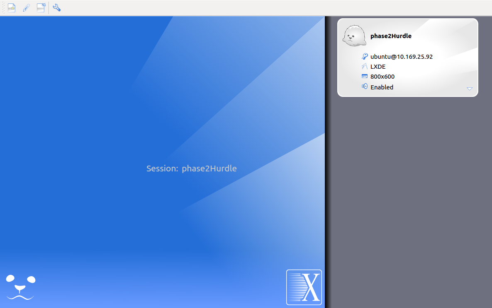
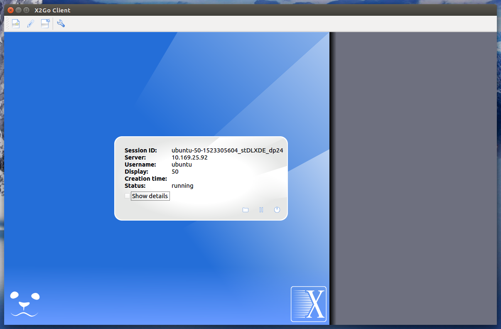
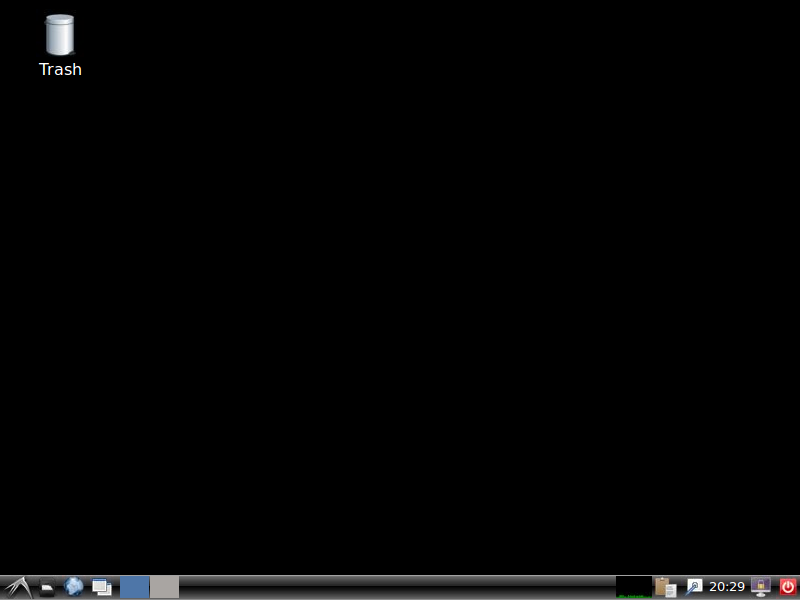

https://spectrumcollaborationchallenge.com

# Introduction

The phase3 hurdle container is an instance of a Ubuntu 16.04 installation running inside an LXC
container. Hurdle participants are encouraged to install any extra debug tools of their choosing to
help them debug their containers and complete the hurdle. All standard Ubuntu tools are available,
starting with apt-get for installing packages from the Ubuntu repository.

All official hurdle evaluations will be done using the default hurdle container posted on GitHub.

The rest of this document will walk users through installing some common debug utilities.

# Installing A Desktop Environment and Remote Desktop Application

It may be useful for some competitors to be able to interact with the Hurdle container using a
graphical interface instead of via SSH or LXD terminals. However, to save on runtime resources and
reduce the container download size, the hurdle container does not have a desktop
environment installed by default. See below for instructions on installing a lightweight desktop
environment and a remote access framework.

These instructions walk you through how to install and use X2Go and LXDE. X2Go is a remote desktop
application similar to VNC or Windows Remote Desktop.
See [New to X2Go](https://wiki.x2go.org/doku.php/doc:newtox2go) for more details.

LXDE is a lightweight desktop environment with good X2Go support. See [lxde.org](https://lxde.org)
for additional details.

## X2Go and LXDE Installation

To install the most up-to-date stable implementation of X2Go server in the hurdle container,
first open up a terminal inside your Phase 3 Hurdle container. Starting with a terminal on your
host, and assuming your hurdle container is running and named phase3Hurdle, run:

```bash
lxc exec phase3Hurdle bash
```

Now run the following command inside the Phase 3 Hurdle container to add the X2Go repository and
update your apt cache:

```bash
add-apt-repository ppa:x2go/stable
apt-get update
```

X2Go runs over SSH, so in addition to X2Go and the LXDE desktop, you'll need to install an OpenSSH
server.

Run the following command inside your hurdle container to install Open SSH, LXDE, X2Go, and the
LXDE bindings for X2Go:

```bash
apt-get install openssh-server lxde  x2goserver x2goserver-xsession x2golxdebindings
```

## SSH Configuration

As previously mentioned, X2Go runs over SSH. For things to work well, you'll need to set up a
non-root user. To be able to easily switch to the root user, you'll also need to set up a root
password.

First set your root password. Start a new root terminal in your phase3Hurdle container:

```bash
lxc exec phase3Hurdle bash
```

Set a new root password:

```bash
passwd
```

Enter your new password twice

We're going to use the ubuntu user for the non-root user in this tutorial. It is already set up
in the container by default. To use with SSH, reset the ubuntu user's password. From inside the
phase3Hurdle container:

```bash
passwd ubuntu
```

Enter the new password twice.

Go back to your host's terminal by typing

```bash
exit
```

## Testing SSH Container Access

To make sure everything is properly configured, test that you can log in to the ubuntu user in the
phase3Hurdle container using SSH.

First find the IP address that the phase3Hurdle container is listening on. Run

```bash
lxc list
```

and look for eth0 in the row next to your container's name. You should see something like this:

```text
+------------------------+---------+--------------------------------+------+------------+-----------+
|          NAME          |  STATE  |              IPV4              | IPV6 |    TYPE    | SNAPSHOTS |
+------------------------+---------+--------------------------------+------+------------+-----------+
| phase3Hurdle-v1-0-0    | RUNNING | 192.168.40.2 (usrpbr0)         |      | PERSISTENT | 0         |
|                        |         | 192.168.106.100 (trbr6)        |      |            |           |
|                        |         | 192.168.105.100 (trbr5)        |      |            |           |
|                        |         | 192.168.104.100 (trbr4)        |      |            |           |
|                        |         | 192.168.103.100 (trbr3)        |      |            |           |
|                        |         | 192.168.102.100 (trbr2)        |      |            |           |
|                        |         | 192.168.101.100 (trbr1)        |      |            |           |
|                        |         | 172.30.101.1 (colbr0)          |      |            |           |
|                        |         | 172.16.1.1 (canbr0)            |      |            |           |
|                        |         | 10.169.25.92 (eth0)            |      |            |           |
+------------------------+---------+--------------------------------+------+------------+-----------+
```

For this example, the IP address associated with the phase3Hurdle container's eth0 interface was
10.169.25.92.

From your host, try to log in to the phase3Hurdle container by running:

```bash
ssh ubuntu@10.169.25.92
```

You will be prompted for a password. Type the password you set up for the ubuntu user in the
previous steps. If successful, you'll see:

```text
Welcome to Ubuntu 16.04.3 LTS (GNU/Linux 4.4.0-116-generic x86_64)

 * Documentation:  https://help.ubuntu.com
 * Management:     https://landscape.canonical.com
 * Support:        https://ubuntu.com/advantage

The programs included with the Ubuntu system are free software;
the exact distribution terms for each program are described in the
individual files in /usr/share/doc/*/copyright.

Ubuntu comes with ABSOLUTELY NO WARRANTY, to the extent permitted by
applicable law.

To run a command as administrator (user "root"), use "sudo <command>".
See "man sudo_root" for details.

ubuntu@phase3Hurdle-v1-0-0:~$
```

You're now logged in to the phase3Hurdle container over SSH. To get to a root user prompt from here,
run:

```bash
su root
```

Enter the root password you set up previously (not the ubuntu user password)

If successful, you'll see the command prompt change to

```bash
root@phase3Hurdle-v1-0-0:/home/ubuntu#
```

If you did not run into any errors while running these steps, you are now ready to start using X2Go.

## Connecting to the phase3Hurdle Container with X2Go

First install the X2Go client on your host. See the instructions for your host at:
[X2Go Client Installation](https://wiki.x2go.org/doku.php/doc:installation:x2goclient)

Now run the X2Go client. If you are using a Ubuntu host, you can launch the client by running:

```bash
x2goclient
```

You should see a window that looks like this:


Create a new session by pressing CTRL + N, or by selecting "New Session" from the Session menu at
the top of the window.

You should see a new window pop up that looks like this:



Add a Session name and fill out the Host and Login fields.

| Field        | Value        | Notes                                    |
|--------------|--------------|------------------------------------------|
| Session Name | phase3Hurdle | this can be anything you want            |
| Host         | 10.169.25.92 | this is the IP address you found earlier |
|Login         | ubuntu       | this is the username you set up earlier  |

Finally, change the Session type drop down menu at the bottom of the screen to LXDE.

Your session window should now look like this:



Click the OK button to save the new session and go back to the X2Go Client window.

You should now see a new session box in the upper right corner of your X2Go client window:



Click on the phase3Hurdle session box in the upper right corner of your X2Go client window to bring
up a login prompt. Enter your password and click OK.

Your X2GO client window should look something like this:



A new window should also pop up that looks like this:



This is your new remote desktop window. You are now connected to the phase3Hurdle container, and
should now be able to launch graphical applications like gnuradio-companion, as well as run
gnuradio flowgraphs that use QT GUI components, like waterfall plots.

# QT GUIs and the Root User

The QT GUI components of GNU Radio don't run well through X2Go as the root user.
To see any of the GUI sinks or use the envsim_viewer, you'll need to be logged in as a normal user,
such as the ubuntu user.

## Copying and Taking Ownership of Envsim_viewer

Normal users don't have direct access to the files in the /root/ directory.
To use any files from that directory, such as the envsim_viewer, you must copy over the GUI files
you need and take ownership of them.

Starting with a terminal inside the phase3Hurdle container, logged in as the ubuntu user, run:

```bash
su root
cp /root/phase3-hurdle/gr-envsim/apps/envsim_viewer.* /home/ubuntu/
chown ubuntu:ubuntu /home/ubuntu/envsim_viewer.*
exit
```

You should now be able to launch GNU Radio Companion with

gnuradio-companion &

See [Envsim Debug Mode](Envsim-Debug-Mode.md) for more details on working with the ENVSIM Viewer.